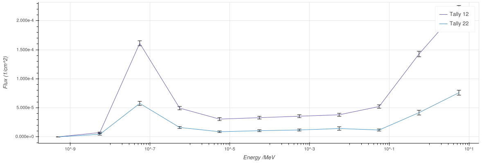
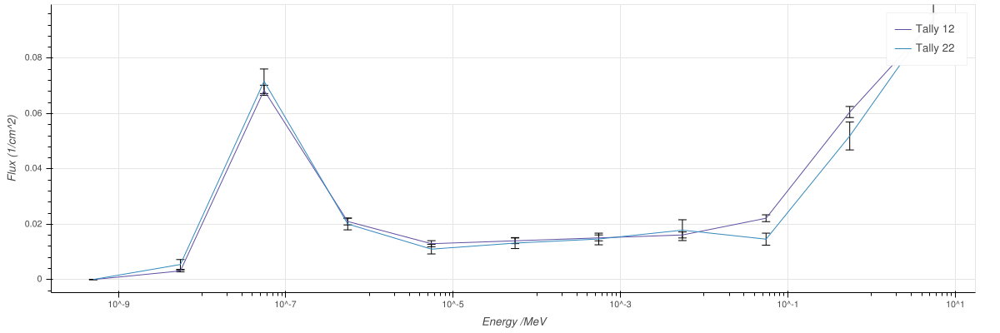

# Reliability

The tallies are defined as follows:
 * Tally 12: The short sides of characteristic length 10cm 
 * Tally 22: The short sides of characteristic length 20cm

For the tallies, MCNP reported that the tallies passed most of the 10 statistical tests for the tally fluctuation chart, which are defined as
  1. Mean is randomly distributed
  1. Relative error ideally less than 0.10
  1. Relative error decreases over time
  1. Decrease rate of relative error follows $\frac{1}{\sqrt{\text{nps}}}$
  1. Variance of variance ideally less than 0.10
  1. Variance of variance decreases over time
  1. Decrease rate of variance of variance follows $\frac{1}{\sqrt{\text{nps}}}$
  1. Figure of Merit (FoM) is roughly constant
  1. FoM is randomly distributed
  1. Slope of the FoM pdf is greater than 3.0
  
The first and last tallies passed all ten tests, whilst Tally 22 failed the final FoM slope PDF test. The final test evaluates whether the central limit theorem is satisfied; that is, both the first and second moments of the PDF exist (and are therefore finite). The second moment $\int_{\infty}^{\infty}{x^2f(x)\operatorname{dx}}$ is observed to exist when $f(x)$ decreases faster than $\frac{1}{x^3}$, and hence the final test evaluates this condition. Furthermore, all tallies had at least one bin with large relative error ($>0.1$). Consequently, in failing this test, it could not be concluded that the predicted tally distributions were reliable.

# Fluences
The total fluences across each pair of surfaces were as follows
 * Long sides (Tally 12): $7.70884E-04\pm 9.3277E-06$ n/cm^2
 * Short sides (Tally 34): $2.53400E-04 \pm 8.2862E-06$ n/cm^2

The significant difference between these two values can be explained by both the variation in solid angle between the two surfaces (each surface is sufficiently large relative to the distance to the source, that the incident flux varies along the surface), and the difference in neutron absorption along the axes of the detector. The neutron absorption probability through a medium is given by the Beer Lambert law, and is exponential in the distrance traveled. 

The normalised (by area) neutron energy distributions are approximately equal, and what variation there exists between the two tallies lies predominantly within the uncertainty on the recorded values. However, there are several points, particularly in the higher energy reigime whose standard errors do not account for the observed deviation. In these cases, the nonlinear attenuation function, which depends upon neutron energy, leads to a distortion of the tallied energy spectrum.

# Fluxes
For a source of $10^{10}$ neutrons per second, the corresponding fluxes would be $7.70884E+06 \pm 9.3277E+04$ n/cm^2/s and $2.53400E+06 \pm 8.2862E+04$ n/cm^2/s respectively.

# Varying number of histories
By increasing the particle histories limit to $200000$, the standard uncertainty upon the tally amplitudes diminishes, approximately $\frac{1}{2}$ as expected. The bin amplitude for Tally 22 corresponding to $1E-08 < x < 1E-09$ did not lie within the uncertainty permitted by its previous value. However, this tally did not pass all statistical tests for $20000$ to allow such a constraint in the first place, and so was to be expected. By increasing the number of particle histories to the new limit, all statistical tests were subsequently passed. Furthermore, the difference in neutron energy distribution between the two tallies became more apparent; in particular, in the higher energy reigime the two distributions diverged most significantly, with the narrower surfaces (further from the source) showing greater attenuation at higher energies.

The recorded fluences were as follows:
 * Long sides (Tally 12): $7.65531E-04\pm 2.9856E-06$ n/cm^2
 * Short sides (Tally 34): $2.5150E-04 \pm 2.5402E-06$ n/cm^2