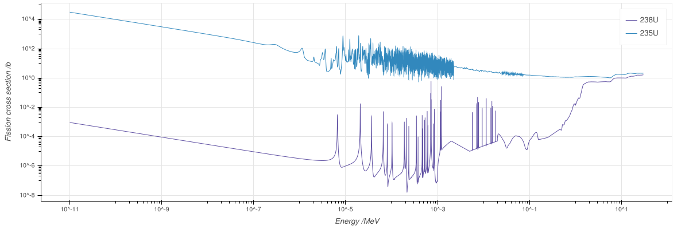

# Part 3

## C
When replacing the moderator material with graphite, the effective criticality of the system was observed to increase. The criticality of a reactor depends upon the number of neutrons which are thermalised (by the moderator) and lead to thermal fission in the fuel. In transitioning the moderator material from light water to graphite, the mean logarithmic energy decrement of the moderator $\xi$ decreases (lesser energy loss per collision), such that the average number of collisions required to thermalise a fast neutron increases by a factor $$\frac{\xi_{H_2O}}{\xi_{C}}=5.8\,.$$
However, the scattering to capture ratio of graphite is far higher than that of light water ($1500$ vs $77.17$), and thus its effective "moderating ratio" $\frac{\xi\sigma_{s}}{\sigma_{a}}$ is greater. This result was observed in the predicted reactivity coefficients for the two systems. In the case of the graphite moderator, the reactivity coefficient was greater (closer to criticality) than that of the light water.

## D
After increasing the enrichment of the uranium cylinders, the reactivity coefficient of both modelled systems was observed to increase. Similarly to the previous configuration, the predicted coefficient for the graphite moderator remained greater than that of the light water.

The observed increase in reactivity derives from the increased effective fission cross section of the fuel that follows fuel enrichment. $^{235}\text{U}$ has a greater fission cross section than $^{238}\text{U}$, and thus increasing the ratio of $^{235}\text{U}$ to $^{238}\text{U}$ in the fuel serves to increase the fission probability, moving the system towards criticality (see $Fig~$).